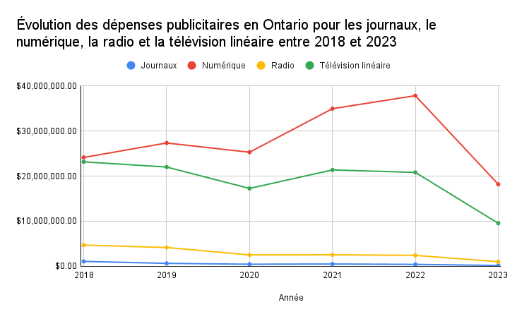
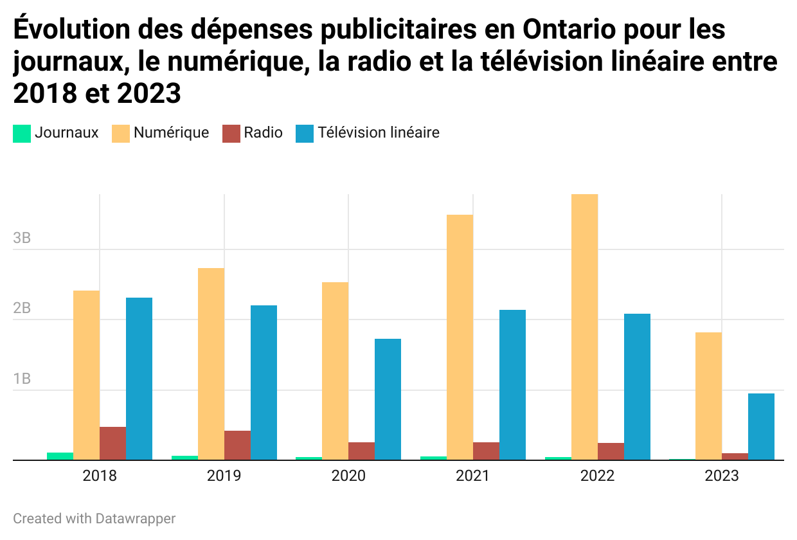
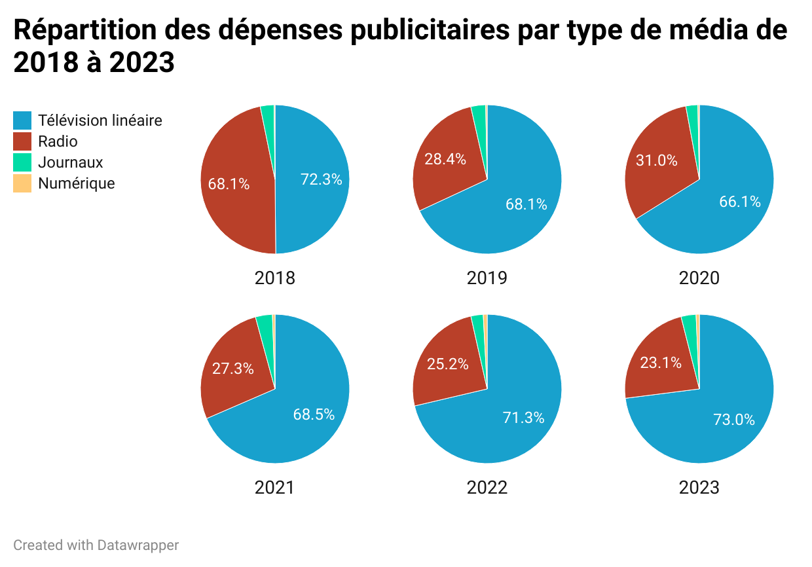

**Le 21 décembre 2023** 
**CMN 4500** 
**Hiba Belmaalem**  
**Présenté à Jean-Sébastien Marier** 

# Ontario : Dépenses publictaires et médias communautaires

Le paysage médiatique canadien a subi d'importantes transformations en termes de dépenses publicitaires, influençant à la fois les médias traditionnels et communautaires. En 2021, les dépenses publicitaires totales des principaux médias d'information canadiens ont atteint 17,3 milliards de dollars, avec une prédominance de la publicité sur Internet. Cette dernière représentait 12,3 milliards de dollars, suivie par la télévision, la radio et les journaux, qui ont généré respectivement 3,1 milliards de dollars, 1 milliard de dollars et 942 millions de dollars. (source) 

Ces changements s'expliquent en partie par la migration des budgets publicitaires des médias traditionnels vers les plateformes en ligne. Les données recueillies par Standard Media Index montrent que les dépenses publicitaires brutes au Canada, couvrant une grande variété de médias et de marchés, représentent plus de 94% des dépenses publicitaires nationales. Ces tendances indiquent une évolution significative dans la répartition des dépenses publicitaires, influençant la manière dont les éditeurs de médias et les plateformes numériques génèrent des revenus (source) 
 
Ce passage au numérique pose des défis aux médias communautaires, qui dépendent généralement des recettes publicitaires de la presse écrite et de la diffusion locale. Une part croissante des budgets publicitaires étant consacrée aux plateformes en ligne, les médias communautaires doivent s'adapter pour conserver leur pertinence et leur viabilité financière dans un écosystème médiatique en pleine mutation.
 

## 1. Le portrait ontarien

Le paysage médiatique de l'Ontario en 2023 présente des tendances intéressantes en matière de dépenses publicitaires. Dans un jeu de données produit par le CRTC (full name) indiquant les dépenses publicitaires brut des agences canadiennes entre 2018 et 2023, les dépenses publicitaires numériques en Ontario ont connu une augmentation significative entre 2018 et 2023, dépassant de loin les autres médias tels que les journaux, la radio et la télévision linéaire. La tendance est à la baisse pour les dépenses publicitaires dans les journaux, avec un déclin particulièrement notable après 2021. La radio et la télévision linéaire semblent rester relativement stables jusqu'en 2021, avant de décliner. 
En 2023, les dépenses numériques diminuent pour la première fois depuis 2018, bien qu'elles restent le média dominant en termes de dépenses publicitaires. Cela pourrait indiquer une évolution du marché ou une réponse aux changements économiques ou technologiques.

 
*Figure 1 : Évolution des dépenses publicitaires en Ontario pour les journaux, le numérique, la radio et la télévision linéaire entre 2018 et 2023.*

Le diagramme à barres  ci-dessous illustre de manière plus claire les dépenses publicitaires pour différents médias en Ontario entre 2018 et 2023. On constate que le numérique domine largement les dépenses publicitaires chaque année, affichant une croissance constante jusqu'en 2021 avant de connaître une légère baisse en 2022 et 2023. Les dépenses consacrées à la radio et à la télévision linéaire restent relativement faibles en comparaison, la radio affichant une tendance à la baisse au fil du temps. Les journaux affichent les montants les plus bas et une baisse constante au fil des ans, ce qui suggère un déclin continu de la publicité imprimée. La baisse des dépenses en publicité numérique en 2023 pourrait refléter un ajustement du marché ou un changement dans les stratégies publicitaires des entreprises.

 
*Figure 2 : Évolution des dépenses publicitaires en Ontario pour les journaux, le numérique, la radio et la télévision linéaire entre 2018 et 2023.*

La série de graphiques ci-dessous montre la répartition des dépenses publicitaires par type de média en Ontario de 2018 à 2023. On constate une domination claire et croissante de la publicité numérique, qui représente une part de plus en plus importante des dépenses totales chaque année. En 2018, la publicité numérique représentait déjà une majorité substantielle de 68,1 %, une part qui passera à 73 % d'ici 2023. En revanche, la télévision linéaire, bien qu'elle soit le deuxième segment le plus important, a vu sa part diminuer légèrement au fil des ans. La radio et les journaux, qui étaient déjà les segments les plus petits en 2018, ont continué à décliner, ce qui suggère un déplacement des préférences et des budgets publicitaires des médias traditionnels vers les plateformes numériques. Cela peut refléter une adaptation aux changements dans la consommation des médias, où les publics se tournent de plus en plus vers les médias numériques pour leur contenu.

 
*Figure 3 : Répartition des dépenses publicitaires par type de média de 2018 à 2023.*

## Analyse des graphiques

Les trois graphiques que nous avons examinés révèlent une tendance claire dans l'évolution des dépenses publicitaires en Ontario, indiquant une préférence croissante pour le numérique au détriment des médias traditionnels. De 2018 à 2023, les dépenses publicitaires numériques ont non seulement augmenté en termes absolus mais aussi en part relative par rapport aux autres médias. En 2022, la part de la publicité numérique atteignait déjà 68,3 % du total des dépenses publicitaires, et l'on prévoit qu'elle atteindra 70,5 % d'ici la fin de 2023 (source).
 
Cette transition vers le numérique reflète une adoption plus large d'Internet par la population canadienne, où 93,8 % des gens sont désormais en ligne, passant en moyenne plus de six heures par jour sur des médias numériques (source). Pour les médias minoritaires, cette transformation représente une occasion unique d'atteindre des audiences ciblées grâce à des coûts relativement plus bas que ceux des médias traditionnels. Cependant, il s'agit aussi d'un défi, car la concurrence pour l'attention dans l'espace numérique est féroce, et les algorithmes de plateformes dominantes comme Google et Facebook peuvent ne pas favoriser les contenus de niche sans investissements publicitaires stratégiques (source).
 

